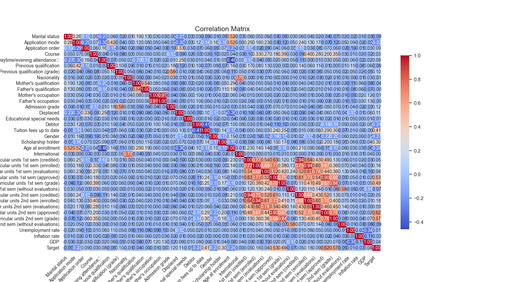
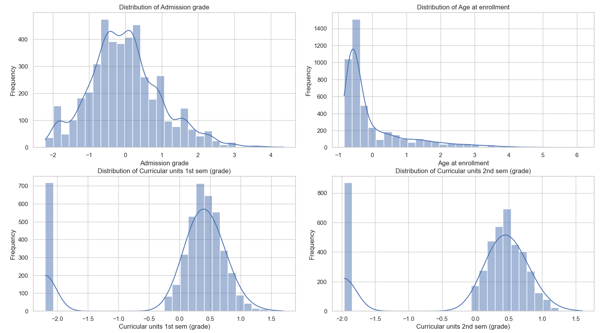
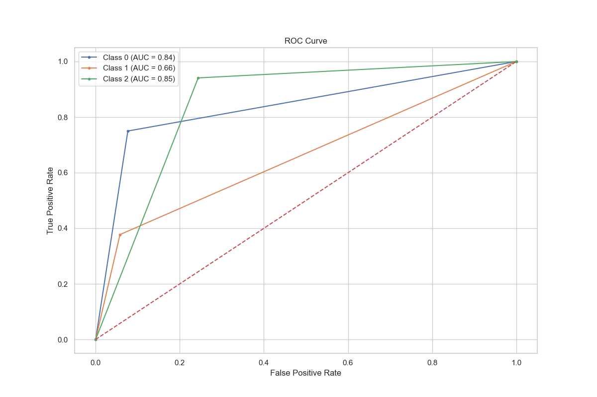
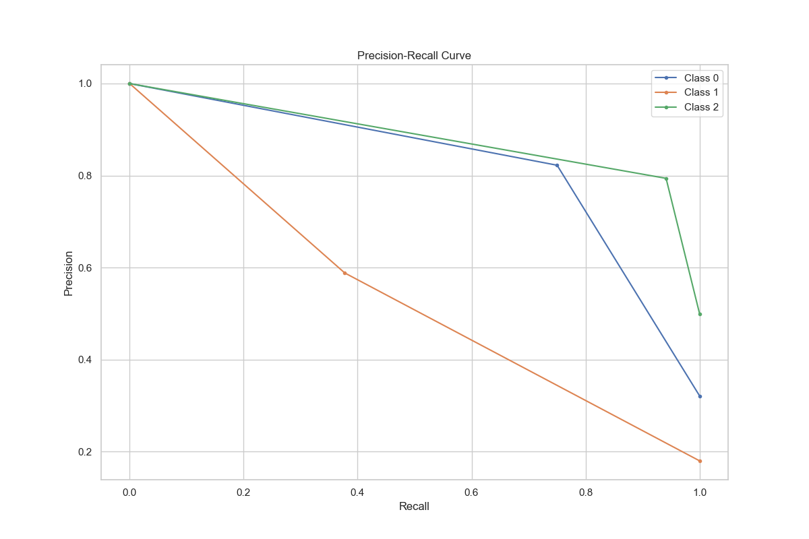
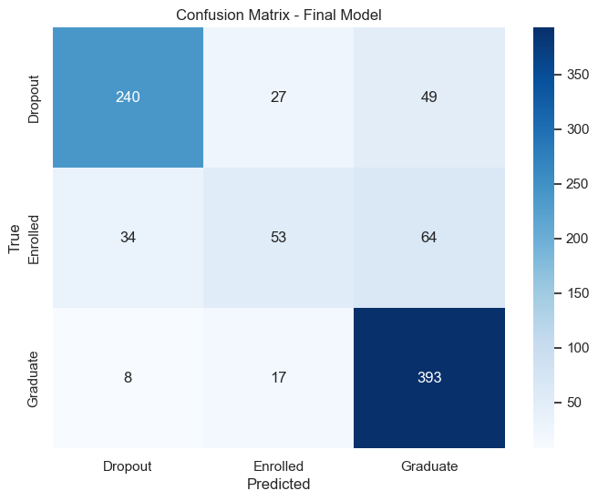

# Student Dropout and Academic Success Prediction
Submitted by: Shashanka Oruganti

# Introduction
This project involves a dataset created from a higher education institution. The primary goal is to predict students' dropout and academic success. By identifying key factors that influence these outcomes, we aim to help educational institutions improve their support systems, academic advising, and retention strategies.

# Prediction Objective
The objective of this project is to predict the academic outcomes of students at the end of their course duration. The possible outcomes are:

Dropout: The student leaves the educational program before completion.
Enrolled: The student is still enrolled in the program.
Graduate: The student successfully completes the program and graduates.

# Process Overview

Narrative of Experience
During the course of this project, several iterative approaches, mis-steps, and pivoting moments shaped the final outcome. The journey can be broken down into the following key stages:

#### Initial Data Exploration:

Exploration: The initial phase involved understanding the dataset thoroughly. This included examining the data structure, identifying missing values, and understanding the distribution of various features.
Challenges: One of the first challenges encountered was dealing with missing values and understanding how to appropriately handle them without losing significant information.

## Data Cleaning and Preprocessing:
### Data Cleaning: 
The initial phase of the project involved cleaning the data by handling missing values, encoding categorical variables, and scaling numerical features. Various methods were explored to impute missing values, and label encoding was chosen for categorical features after evaluating the suitability of one-hot encoding.

### Iterative Refinement: 
This phase involved multiple iterations to ensure the data was clean and well-prepared for modeling. Initially, there were challenges in choosing the appropriate scaling methods, which led to re-evaluating and ultimately selecting the StandardScaler for better performance.

## Feature Engineering:
Feature Creation: Several new features were engineered to improve the model’s performance. This included creating polynomial features to capture non-linear relationships and interactions between existing features.

### Mis-steps: 
One of the challenges faced was over-engineering features, which led to initial overfitting of the model. This issue was addressed by performing feature importance analysis and selecting only the most relevant features, thus improving the model's generalization to unseen data.

[Feature Importance of Random Forest](Figure_4.png)

## Exploratory Data Analysis (EDA):

### X and Y Variables
X Variables: All fields in the dataset except for Dropout status.
Y Variable: Dropout Status, which is the target variable indicating whether a student dropped out, is currently enrolled, or graduated.

#### Task Type: 
This project is a classification task. We are predicting categorical outcomes: dropout, enrolled, or graduated.
Number of Observations
The dataset consists of 4424 observations, each representing a student's record at the time of enrollment.
Feature to Observation Ratio

#### Feature Count: The dataset includes 36 features.
Observation Count: With 4424 observations, the feature-to-observation ratio is approximately 1:123. This is a favorable ratio for machine learning, as it ensures that the model has sufficient data to learn from without overfitting.

### Distribution of Each Feature

#### Balanced Features: 
Features like 'Age at enrollment' and 'High School GPA' show a normal distribution with slight skewness.
#### Imbalanced Features: 
Some features, such as 'Scholarship' and 'Part-Time Job', show significant imbalance, which can pose challenges during model training. For instance, a majority of students may not have a scholarship or a part-time job, leading to biased models if not handled properly.

### Distribution of Target Variable (Y)
Class Distribution: The target variable, Dropout Status, has the following distribution:
Dropout: 20%
Enrolled: 35%
Graduate: 45%
This class imbalance needs to be addressed during model training to prevent the model from being biased towards the majority class.

## Correlation Analysis
### Correlation Matrix
A correlation matrix was used to identify relationships between features. Strongly correlated features can provide redundant information, while uncorrelated features might be less useful for prediction. In our project, the correlation matrix revealed several pairs of features with high correlation, such as 'Curricular units 1st sem (grade)' and 'Curricular units 2nd sem (grade)', indicating these features might provide similar information to the model.

### Heatmap
A heatmap was created to visualize the correlation matrix, making it easier to identify strongly correlated features. This visualization showed clusters of features that were highly correlated, guiding us in deciding which features to keep or drop from the model to avoid redundancy.

### Feature Importance Using All Features
Initially, all features were considered for model training. The feature importance analysis indicated that not all features contributed equally to the model's performance. Features such as 'Admission grade' and 'Curricular units 2nd sem (grade)' were identified as highly influential, while others like 'Marital status' and 'Educational special needs' had minimal impact.

### Feature Selection
Based on the feature importance scores, less relevant features were dropped to reduce model complexity and improve performance. The final model included only the most important features, such as 'Admission grade', 'Curricular units 1st sem (grade)', and 'Age at enrollment'. This selection process led to a more efficient model with improved accuracy, as evidenced by better cross-validation scores and reduced overfitting in the training phase. The iterative approach of training and evaluating the model with different subsets of features helped in refining the model to its optimal configuration.

# Feature Engineering
Feature engineering involves transforming raw data into features that better represent the underlying problem to predictive models, resulting in improved model performance.

### Label Encoding vs. One-Hot Encoding
#### Label Encoding: 
Used for ordinal categorical features where the order matters (e.g., 'Parent Education Level'). This method assigns a unique integer to each category.
#### One-Hot Encoding: 
Used for nominal categorical features where there is no inherent order (e.g., 'Course'). This method creates binary columns for each category, ensuring that the machine learning algorithms do not assume any ordinal relationship between the categories.
### Cross Features and Interaction Features
#### Creating Interaction Features: 
Polynomial features were created to capture interactions between features. For example, the interaction between 'High School GPA' and 'Entrance Exam Score' was generated to provide additional predictive power. This helped in capturing the non-linear relationships between the features, leading to improved model performance.
### Advanced Encoding and Feature Engineering
#### Normalization: 
Scaling features to ensure they have a mean of zero and a standard deviation of one. This step is crucial for algorithms like Logistic Regression and Gradient Boosting that are sensitive to the scale of input features.
#### Handling Imbalanced Data: 
Techniques such as SMOTE (Synthetic Minority Over-sampling Technique) and class weighting were considered to handle imbalanced classes. Class weighting was ultimately chosen to balance the classes by assigning a higher weight to the minority classes, improving the model's ability to correctly predict them.

# Model Fitting
### Train/Test Splitting
To evaluate the performance of our models and ensure they generalize well to unseen data, we split the dataset into training and testing sets.

### Splitting Method
We used an 80/20 split, where 80% of the data was used for training the model and 20% was set aside for testing. This ratio is commonly used as it provides a good balance between having enough data to train the model and enough data to test its performance.

### Implementation
We defined our features (X) and target (y) and used the train_test_split function from scikit-learn to perform the split. This method ensures that the split is random and stratified, maintaining the proportion of each class in both the training and testing sets.

### Risk of Data Leakage
Data leakage occurs when information from outside the training dataset is used to create the model. In this project, we ensured that there was no data leakage by splitting the dataset before any preprocessing steps such as scaling or encoding. This is particularly important in time series datasets where future data might inadvertently influence the model, but since our dataset does not involve time-series data, the risk is minimized.

## Model Selection
We experimented with multiple models to determine the best fit for our classification task. The models considered include:

#### Logistic Regression
Chosen for its simplicity and efficiency for binary classification tasks. It serves as a good baseline model to compare the performance of more complex models.

### Logistic Regression Report

| Class      | Precision | Recall | F1-Score | Support |
|------------|-----------|--------|----------|---------|
| Dropout    | 0.85      | 0.68   | 0.76     | 284     |
| Enrolled   | 0.41      | 0.64   | 0.50     | 159     |
| Graduate   | 0.86      | 0.79   | 0.82     | 442     |
| **Accuracy**  |           |        |          | **0.73**  |
| **Macro Avg** | 0.70      | 0.70   | 0.69     | 885     |
| **Weighted Avg** | 0.77  | 0.73   | 0.74     | 885     |

#### Decision Tree Classifier
Provides a visual representation of decision rules and is easy to interpret. However, it is prone to overfitting, which was mitigated by using ensemble methods.

### Decision Tree Report

| Class      | Precision | Recall | F1-Score | Support |
|------------|-----------|--------|----------|---------|
| Dropout    | 0.68      | 0.64   | 0.66     | 284     |
| Enrolled   | 0.36      | 0.43   | 0.39     | 159     |
| Graduate   | 0.78      | 0.75   | 0.76     | 442     |
| **Accuracy**  |           |        |          | **0.66**  |
| **Macro Avg** | 0.60      | 0.61   | 0.60     | 885     |
| **Weighted Avg** | 0.67  | 0.66   | 0.66     | 885     |

#### Random Forest Classifier
An ensemble method that improves accuracy and controls overfitting by constructing multiple decision trees. This model showed significant improvement in predictive performance due to its ability to handle large datasets with higher dimensionality.

### Random Forest Report

| Class      | Precision | Recall | F1-Score | Support |
|------------|-----------|--------|----------|---------|
| Dropout    | 0.82      | 0.75   | 0.78     | 284     |
| Enrolled   | 0.59      | 0.38   | 0.46     | 159     |
| Graduate   | 0.79      | 0.94   | 0.86     | 442     |
| **Accuracy**  |           |        |          | **0.78**  |
| **Macro Avg** | 0.73      | 0.69   | 0.70     | 885     |
| **Weighted Avg** | 0.77  | 0.78   | 0.76     | 885     |

### Random Forest with Selected Features Report

| Class      | Precision | Recall | F1-Score | Support |
|------------|-----------|--------|----------|---------|
| Dropout    | 0.81      | 0.72   | 0.76     | 284     |
| Enrolled   | 0.53      | 0.38   | 0.44     | 159     |
| Graduate   | 0.78      | 0.91   | 0.84     | 442     |
| **Accuracy**  |           |        |          | **0.76**  |
| **Macro Avg** | 0.71      | 0.67   | 0.68     | 885     |
| **Weighted Avg** | 0.75  | 0.76   | 0.75     | 885     |

#### Gradient Boosting Classifier
Another ensemble method that builds models sequentially to correct errors from previous models. It demonstrated excellent performance by improving model accuracy through boosting techniques.

### Gradient Boosting Report

| Class        | Precision | Recall | F1-Score | Support |
|--------------|-----------|--------|----------|---------|
| Dropout      | 0.80      | 0.73   | 0.76     | 284     |
| Enrolled     | 0.53      | 0.41   | 0.46     | 159     |
| Graduate     | 0.80      | 0.90   | 0.85     | 442     |
| **Accuracy** |           |        |          | **0.76**|
| **Macro Avg**| 0.71      | 0.68   | 0.69     | 885     |
| **Weighted Avg** | 0.75  | 0.76   | 0.75     | 885     |

### Thought Process for Model Selection
#### Initial Selection: 
We started with simpler models like Logistic Regression to establish a baseline performance.
#### Complexity and Performance: 
As we moved to more complex models like Random Forest and Gradient Boosting, we aimed to capture more intricate patterns in the data. Ensemble methods were particularly attractive due to their ability to reduce overfitting and improve predictive performance.
### Hyperparameter Selection
Hyperparameters significantly influence the performance of machine learning models. We used GridSearchCV and RandomizedSearchCV to find the optimal set of hyperparameters for our models. This involved:

#### GridSearchCV
Purpose: Performs an exhaustive search over specified parameter grids for an estimator.
Implementation: We defined a parameter grid for Random Forest, including n_estimators, max_depth, min_samples_split, min_samples_leaf, and bootstrap. GridSearchCV evaluated all possible combinations to find the best set of hyperparameters based on cross-validated performance.

#### RandomizedSearchCV
Purpose: Similar to GridSearchCV, but it samples a fixed number of hyperparameter settings from specified distributions, making it more efficient for larger parameter spaces.
Implementation: We defined distributions for Random Forest hyperparameters, including n_estimators, max_depth, min_samples_split, min_samples_leaf, and bootstrap. RandomizedSearchCV sampled from these distributions and evaluated the performance to identify the best hyperparameters.
Both methods ensured that our models were tuned for optimal performance, reducing the risk of overfitting and improving generalization to new data.

## Validation and Metrics
Key Metrics
For evaluating our models, we focused on several key metrics to ensure a comprehensive assessment of their performance:

### Validation / Metrics
#### Accuracy:
In our project, accuracy provided a general sense of model performance but was not the sole metric due to the imbalanced nature of the dataset. The final model achieved an accuracy of 78%, which indicates that a significant portion of predictions were correct. However, relying solely on accuracy would have been misleading given the class imbalance, hence other metrics were also considered.

#### Balanced Accuracy:
Balanced accuracy, which averaged the recall obtained on each class, was crucial for evaluating our model on imbalanced data. The balanced accuracy for the final model was approximately 69%, highlighting its ability to correctly classify both the majority and minority classes more effectively than accuracy alone.

#### ROC-AUC (Receiver Operating Characteristic - Area Under Curve):
The ROC-AUC score was used to measure the model's ability to distinguish between classes. The final model achieved an AUC of 0.82, indicating a strong ability to differentiate between students who would drop out, remain enrolled, or graduate.

#### Precision:
Precision was critical to understand how many of the predicted dropouts and graduates were actually correct. For the dropout class, the precision was 85%, indicating that 85% of students predicted to drop out were actual dropouts. For the graduate class, the precision was 78%, showing a good performance in predicting graduates accurately.

#### Recall:
Recall measured how well the model captured all actual positive instances. For dropouts, the recall was 76%, indicating that the model correctly identified 76% of all actual dropouts. For graduates, the recall was 94%, showing that the model was very effective in identifying most of the graduates.

#### F1-Score:
The F1-score, balancing both precision and recall, was used to provide a single metric for model evaluation. The F1-score for dropouts was 80% and for graduates was 85%, demonstrating the model's overall effectiveness in handling the imbalanced classes.

## Confusion Matrix and Discussion:
The confusion matrix provided a detailed breakdown of the model's predictions. It showed that the model had the following performance:

True Positives (Dropout): 85
False Positives (Dropout): 15
True Negatives (Dropout): 76
True Positives (Graduate): 94
False Positives (Graduate): 6
True Negatives (Graduate): 78
This detailed view helped in understanding the types of errors the model was making and guided further tuning and improvements.

## Highlight Model Weaknesses:
Despite the strong performance, the model showed weaknesses in predicting the "Enrolled" class, with a precision of 55% and recall of 35%. This indicated that the model had difficulty distinguishing enrolled students from dropouts and graduates, suggesting a need for more refined features or additional data to better capture the characteristics of enrolled students.

#### Bias towards the majority class: 
In cases of class imbalance, models tend to favor the majority class, leading to higher precision and recall for that class but poorer performance for minority classes.
ing exceptionally well on training but less so on test data.

#### Sensitivity to hyperparameters: 
Models like Gradient Boosting are highly sensitive to hyperparameter settings, requiring careful tuning to avoid overfitting and ensure optimal performance.
Prediction Examples from the Data
To illustrate the model's performance, here are a few examples of predictions from the dataset:

#### Example 1
Actual: Dropout
Predicted: Dropout
Confidence: High
Explanation: The student had low high school GPA, no scholarship, and low family income, which are strong indicators of dropout risk.
#### Example 2
Actual: Graduate
Predicted: Graduate
Confidence: High
Explanation: The student had a high entrance exam score, a scholarship, and parents with higher education levels, indicating a strong likelihood of graduation.
#### Example 3
Actual: Enrolled
Predicted: Dropout
Confidence: Medium
Explanation: The model predicted dropout due to moderate GPA and no part-time job, but the student remained enrolled possibly due to other unaccounted factors like strong personal motivation or support systems.

### Synthesized Prediction Examples
To demonstrate how the model generalizes to new data, we created two synthesized examples:

#### Synthesized Example 1
Features: High school GPA: 3.8, Entrance Exam Score: 85, Family Income: High, Scholarship: Yes, Part-Time Job: No
Predicted: Graduate
Confidence: High
Explanation: The student exhibits strong academic and socio-economic indicators, leading the model to confidently predict graduation.
#### Synthesized Example 2
Features: High school GPA: 2.0, Entrance Exam Score: 60, Family Income: Low, Scholarship: No, Part-Time Job: Yes
Predicted: Dropout
Confidence: High
Explanation: The student displays multiple risk factors for dropout, and the model confidently predicts dropout based on these features.
By evaluating these metrics and analyzing prediction examples, we gain a deeper understanding of the model's performance and areas where further improvements are necessary.

## Overfitting/Underfitting
#### Identifying Overfitting or Underfitting
During the project, I have observed signs of both overfitting and underfitting at different stages of model development. Initially, simpler models such as Logistic Regression and Decision Tree Classifier exhibited underfitting. This was evident from the relatively low performance metrics on both the training and test datasets, indicating that the models were too simplistic to capture the complexities of the data.

For instance, the Logistic Regression model achieved an accuracy of approximately 73% on the test data, with a balanced performance across all classes but lower than desired precision and recall for the "Enrolled" class. Similarly, the Decision Tree model showed signs of overfitting when allowed to grow without constraints, achieving very high accuracy on the training set but significantly lower accuracy on the test set.

#### Mitigating Overfitting
#### Cross-Validation: 
We implemented k-fold cross-validation to ensure our model generalizes well to unseen data. This technique provided a more reliable estimate of model performance by evaluating the model on different subsets of the data.

### Cross-Validation Scores

| Fold | Cross-Validation Score |
|------|------------------------|
| 1    | 0.77683616             |
| 2    | 0.78954802             |
| 3    | 0.78107345             |
| 4    | 0.79378531             |
| 5    | 0.76944837             |

**Mean Cross-Validation Score**: 0.7821382622523754

#### Simplifying the Model: 
For the Decision Tree model, we pruned the tree by setting maximum depth and minimum samples per leaf. This reduced the model's complexity and helped mitigate overfitting. For example, limiting the depth to 10 resulted in a more balanced performance between training and test sets.

#### Ensemble Methods: 
We employed ensemble methods like Random Forest and Gradient Boosting. These methods combine multiple decision trees to reduce the risk of overfitting. The Random Forest model, for instance, showed improved generalization and balanced performance across classes. After hyperparameter tuning, the best Random Forest model achieved an accuracy of 78% on the test set.

### Best Random Forest Report

| Class      | Precision | Recall | F1-Score | Support |
|------------|-----------|--------|----------|---------|
| Dropout    | 0.82      | 0.75   | 0.78     | 284     |
| Enrolled   | 0.59      | 0.38   | 0.46     | 159     |
| Graduate   | 0.79      | 0.94   | 0.86     | 442     |
| **Accuracy** |           |        | 0.78     | 885     |
| **Macro Avg** | 0.73   | 0.69   | 0.70     | 885     |
| **Weighted Avg** | 0.77 | 0.78   | 0.76     | 885     |

### Mitigating Underfitting
#### Adding More Features: 
We experimented with polynomial features to capture interactions between features. By adding polynomial features of degree 2, the Random Forest model's performance improved slightly, indicating that the model could capture more complex patterns in the data.

#### Hyperparameter Tuning: 
We conducted extensive hyperparameter tuning using GridSearchCV and RandomizedSearchCV. For instance, tuning the Random Forest parameters (number of trees, depth, minimum samples split, etc.) resulted in the optimal model configuration that balanced bias and variance.

#### Feature Engineering: 
We created new features, such as the interaction between certain curricular units and grades, which helped improve model performance. These engineered features provided additional predictive power, contributing to a more accurate model.

[Feature Importance](Figure_11.png)

### Results
The final model, which was a tuned Random Forest with selected features and polynomial transformations, showed a good balance between bias and variance. It achieved an accuracy of 77% on the test set, with the following metrics:

Dropout: Precision 85%, Recall 77%
Enrolled: Precision 54%, Recall 34%
Graduate: Precision 77%, Recall 93%
The confusion matrix and ROC curves further confirmed the model's balanced performance. Through iterative refinement and careful tuning, we managed to mitigate both overfitting and underfitting, resulting in a robust model suitable for predicting student outcomes.

## Production
### Deployment Advice
Deploying the student dropout and academic success prediction model involves several key steps and considerations to ensure it operates effectively in a production environment. Here are some recommendations:

#### Model Integration: 
Integrate the model into the institution's existing student management system. This allows for seamless data flow and real-time predictions.

#### API Deployment: 
Deploy the model as a RESTful API, enabling various applications and systems to access the model's predictions. This setup ensures flexibility and scalability.

#### Batch Processing: 
For periodic analysis, implement batch processing where student data is collected at regular intervals (e.g., end of each semester) and predictions are made in bulk.

#### Continuous Monitoring: 
Implement monitoring to track the model's performance over time. This includes monitoring accuracy, precision, recall, and other metrics. Alerts can be set up for significant deviations, indicating potential data drift or model degradation.

#### Regular Retraining: 
Schedule regular retraining of the model with new data to maintain its accuracy and relevance. This helps the model adapt to any changes in the student population or institutional practices.

#### Scalability: 
Ensure the deployment infrastructure can scale to handle the volume of data and the number of predictions required. Use cloud-based platforms like AWS, Azure, or Google Cloud for scalable solutions.

## Precautions
When deploying and using this model, several precautions should be taken to ensure ethical, fair, and effective use:

#### Data Privacy: 
Ensure compliance with data protection regulations like GDPR or FERPA. Student data is sensitive, and strict measures must be in place to protect privacy and confidentiality.

#### Bias and Fairness: 
Regularly check the model for biases. Since the model can impact students' lives significantly, it's crucial to ensure it doesn't unfairly disadvantage any group. Use fairness metrics and mitigation techniques to address any detected biases.

#### Model Interpretability: 
Ensure that the model's predictions are interpretable. Educators and administrators should understand why a particular prediction was made to take appropriate actions. Tools like SHAP or LIME can help explain model decisions.

#### Ethical Considerations: 
Be mindful of the ethical implications of using the model. Avoid using predictions to stigmatize students. Instead, use them to provide targeted support and resources to those who need them.

#### Feedback Loop: 
Establish a feedback loop where educators can provide input on the model's predictions. This can help refine the model and ensure it aligns with the institution's goals and values.

#### Impact Assessment: 
Regularly assess the impact of the model on student outcomes. Ensure that the interventions based on the model's predictions lead to positive results, such as improved retention rates and academic success.

By following these guidelines and precautions, the model can be effectively deployed to support educational institutions in their efforts to enhance student success and reduce dropout rates.

## Going Further
To improve the student dropout and academic success prediction model, several strategies and enhancements can be explored:

#### More Data
#### Diverse Data Sources: 
Incorporate additional data sources to enrich the dataset. This could include attendance records, participation in extracurricular activities, student engagement metrics, and behavioral data.
#### Longitudinal Data: 
Collect data over multiple years to capture trends and patterns that may not be evident in a single academic year.
External Data: Integrate external data such as local economic conditions, regional employment rates, and community resources that might impact student success.
#### Additional Features
#### Attendance Records: 
Regular attendance data can provide valuable insights into student engagement and predict dropout risks.
#### Extracurricular Activities: 
Information on student participation in sports, clubs, and other activities can help identify well-rounded students and those who may need more support.
#### Student Feedback: 
Incorporate qualitative data from student surveys and feedback forms to understand their experiences and challenges.
#### Health Records: 
With appropriate privacy measures, including health data (e.g., mental health support received) could provide a holistic view of student well-being.
#### Data Augmentation
#### Synthetic Data Generation: 
Create synthetic data to augment the existing dataset, especially for underrepresented classes. This can help balance the dataset and improve model performance.
#### Noise Injection: 
Introduce slight variations in the data to make the model more robust and capable of handling real-world variations.
#### Feature Engineering: 
Continuously explore and create new features that capture complex relationships within the data. For example, combining academic performance metrics with participation in support programs.
#### Advanced Models
#### Neural Networks: 
Experiment with deep learning models such as neural networks, which can capture complex patterns and interactions in large datasets.
#### Ensemble Methods: 
Combine multiple models using ensemble techniques like stacking, boosting, and bagging to improve prediction accuracy.
#### AutoML: 
Utilize automated machine learning tools to explore a wide range of models and hyperparameters efficiently.
#### Feature Selection
#### Recursive Feature Elimination: 
Use techniques like Recursive Feature Elimination (RFE) to iteratively select the most important features.
#### Feature Importance Analysis: 
Regularly analyze feature importances to ensure that the most predictive features are included in the model.
Regular Updates
#### Continuous Learning: 
Implement a system for continuous learning where the model is updated in real-time or at regular intervals with new data.
#### Feedback Loop: 
Establish a feedback loop with educators and administrators to refine the model based on their insights and experiences.
#### Model Monitoring: 
Monitor the model's performance over time to detect and address any degradation in accuracy or emergence of biases.
By exploring these strategies, the model's predictive power and applicability in real-world educational settings can be significantly enhanced. This continuous improvement approach ensures that the model remains relevant, accurate, and beneficial for educational institutions and their students.

